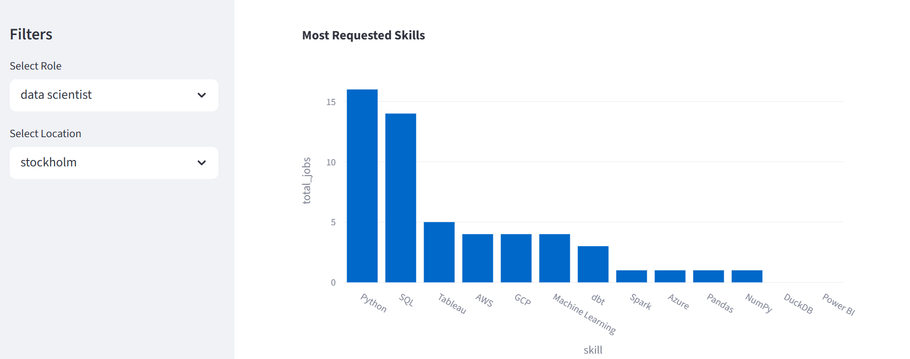
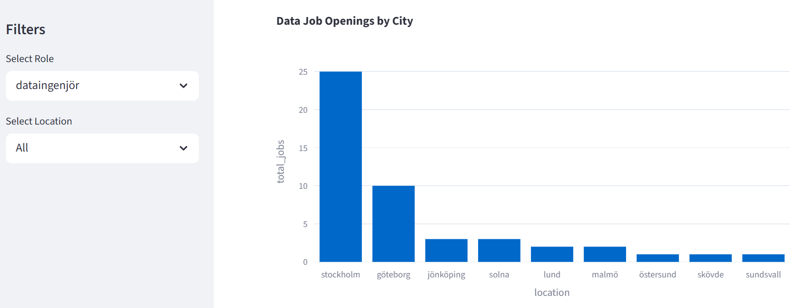
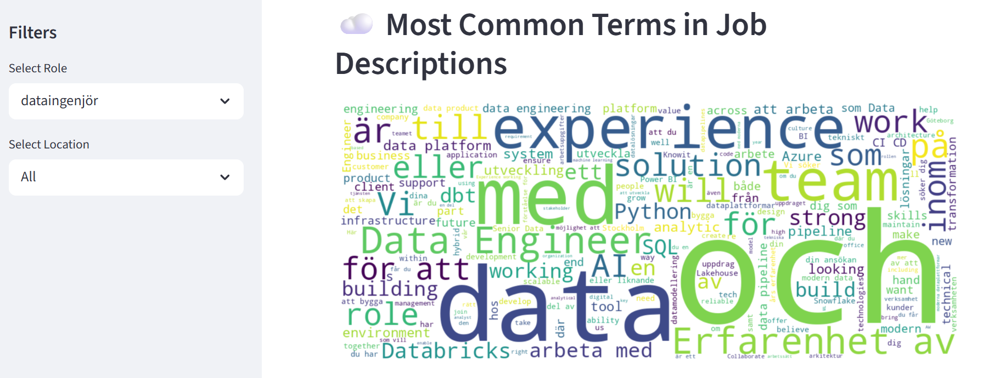
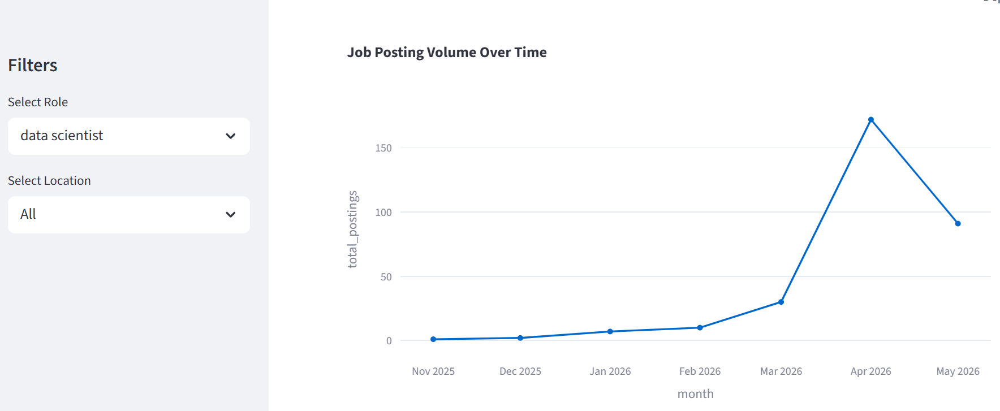
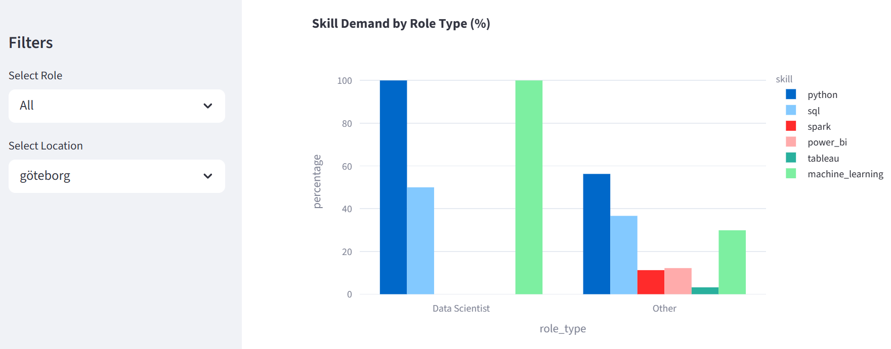

# Swedish Job Market Analysis

## Problem Statement

This project analyzes the Swedish data job market to answer the question:

> Which data science tools and skills are Swedish companies hiring for right now?

The demand for data professionals continues to grow rapidly across industries. Understanding which technologies and skills employers prioritize can help:

* Students identify valuable technical skills
* Professionals plan career development
* Recruiters understand market trends
* Companies benchmark hiring demand
* Analysts explore the Swedish tech ecosystem

This project builds a complete end-to-end data pipeline that collects Swedish job listings, transforms and analyzes the data, and presents insights through an interactive dashboard.

---

# Data Source

## API Used

The project uses the JobTech API from Arbetsförmedlingen (Sweden’s Public Employment Service).

API:

* JobSearch API
* Base URL: [https://jobsearch.api.jobtechdev.se](https://jobsearch.api.jobtechdev.se)

The JobSearch API is publicly available and does not require authentication for basic usage.

## Data Collection Process

Job listings were collected using Python and the Requests library.

The following search terms were used to retrieve data-related jobs:

* data scientist
* data analyst
* data engineer
* machine learning

At least 500 job postings were collected.

For each job listing, the following fields were extracted:

* Job title
* Job description
* Employer name
* Location
* Publication date
* Occupation
* Search term
* Source URL

The raw data was stored in:

```text
/data/raw/
```

The data was then loaded into a DuckDB database for SQL-based querying and transformation.

---

# Dashboard Preview


## Top Skills Analysis



## Jobs by City



## Word Cloud



## Jobs Posting over Time



## Skill_Demand_by_Roll



# Approach

## Data Pipeline

The pipeline consists of the following stages:

1. Data ingestion from the JobTech API
2. Storage in DuckDB
3. Data transformation with dbt
4. Skill extraction using SQL keyword matching
5. Analysis using DuckDB and Pandas
6. Interactive visualization with Streamlit

## Data Cleaning

A dbt staging model was created to:

* Standardize column names
* Normalize text fields
* Remove duplicate job postings
* Parse publication dates
* Prepare clean analytical tables

## Skill Extraction Logic

Skills were extracted from job descriptions using keyword matching.

Examples of tracked skills:

* Python
* SQL
* dbt
* DuckDB
* Spark
* Tableau
* Power BI
* AWS
* Azure
* GCP
* Pandas
* NumPy
* Machine Learning

The extraction logic was implemented in dbt models using SQL CASE statements.

Example:

```sql
CASE
    WHEN LOWER(description) LIKE '%python%'
    THEN 1 ELSE 0
END AS python
```

The transformed data was aggregated into analytical marts for dashboard reporting.

---

# Tech Stack

## Languages

* Python
* SQL

## Data Engineering

* DuckDB
* dbt Core
* Pandas
* Requests

## Data Visualization

* Streamlit
* Plotly
* Matplotlib
* WordCloud

## Development Tools

* GitHub
* PowerShell
* Virtual Environments (venv)

---

# Key Findings

## Top 5 Most In-Demand Skills

Based on the analyzed Swedish data job postings, the most frequently requested skills were:

1. SQL
2. Python
3. Power BI
4. AWS
5. Spark

## Additional Insights

* SQL appeared in the majority of data-related job postings.
* Python was especially common in data scientist and machine learning roles.
* Power BI was highly demanded in analyst positions.
* Spark and cloud technologies were more common in data engineering jobs.
* Stockholm had the highest concentration of data-related openings.

## Surprising Results

* dbt and DuckDB appeared less frequently but showed growing adoption.
* Visualization tools like Power BI appeared more often than Tableau.
* Cloud platform demand was consistently strong across multiple role types.

---

# Takeaways

This project revealed several important trends in the Swedish job market:

* SQL remains a foundational skill for nearly all data roles.
* Data engineering demand is growing alongside cloud infrastructure adoption.
* Business intelligence and reporting skills remain highly valuable.
* Companies increasingly seek hybrid skill sets combining analytics, engineering, and cloud technologies.
* Stockholm continues to dominate Sweden’s data job market.

The project also demonstrated how modern data engineering tools can be combined into a complete analytics workflow.

---

# Future Development

Potential future improvements include:

* Salary analysis
* Time-series trend analysis
* NLP-based skill extraction
* Sentiment analysis of job descriptions
* Employer-level analytics
* Automated daily pipeline updates
* Cloud deployment
* Interactive maps
* Machine learning classification of job categories
* Historical trend tracking using the JobStream API

Additional enhancements could improve both analytical accuracy and dashboard usability.

---

# How to Run the Project

## 1. Clone the Repository

```bash
git clone https://github.com/Archana-Thakare/swedish-job-market-analysis.git
cd swedish-job-market-analysis
```

## 2. Create a Virtual Environment

### Windows PowerShell

```powershell
python -m venv venv
.\venv\Scripts\Activate.ps1
```

### macOS/Linux

```bash
python3 -m venv venv
source venv/bin/activate
```

---

## 3. Install Dependencies

```bash
pip install -r requirements.txt
```

---

## 4. Collect Job Data

```bash
python src/api/fetch_jobs.py
```

This will:

* Fetch job listings from the JobTech API
* Save raw JSON/CSV files
* Load data into DuckDB

---

## 5. Configure dbt

cd dbt_project
dbt init job_market
Choose:
1. duckdb

Create a dbt profile named:

```text
job_market
```

and point it to:

```text
data/duckdb/job_market.duckdb
```
Configure the DuckDB connection

Locate ~/.dbt/profiles.yml

The path should point to your job_market.duckdb file


Verify the connection:

```bash
cd dbt_project/job_market
```

```bash
dbt debug
```

---


## 6. Run dbt Transformations

Navigate to the dbt project:

```bash
cd dbt_project/job_market
```

Run transformations:

```bash
dbt run
```

Run tests:

```bash
dbt test
```

Generate documentation:

```bash
dbt docs generate
```

---

## 7. Run Analysis Scripts

From the project root:

```bash
python src/analysis/analyze_jobs.py
```

---

## 8. Launch the Streamlit Dashboard

From the repository root:

```bash
python -m streamlit run streamlit_app/app.py
```

Open in browser:

```text
http://localhost:8501
```

---

# Project Structure

```text
swedish-job-market-analysis/
│
├── data/
│   ├── raw/
│   ├── processed/
│   └── duckdb/
│
├── src/
│   ├── api/
|       └──fetch_jobs.py
│   └── analysis/
        └──analyze_jobs.py
│   
│
├── dbt_project/
│   └── job_market/
│
├── streamlit_app/
|   └──app.py
│
├── requirements.txt
├── README.md
└── .gitignore
```

---

# Dashboard Features

The Streamlit dashboard includes:

* Top in-demand skills visualization
* Jobs by city analysis
* Skill comparison by role type
* Interactive filtering
* Word cloud visualization
* Posting trend analysis

---

# Conclusion

This project demonstrates a complete modern data workflow using:

* API ingestion
* Data warehousing
* SQL transformations
* Analytical modeling
* Interactive visualization

It provides practical insights into the Swedish data job market while showcasing data engineering and analytics skills using real-world technologies.
